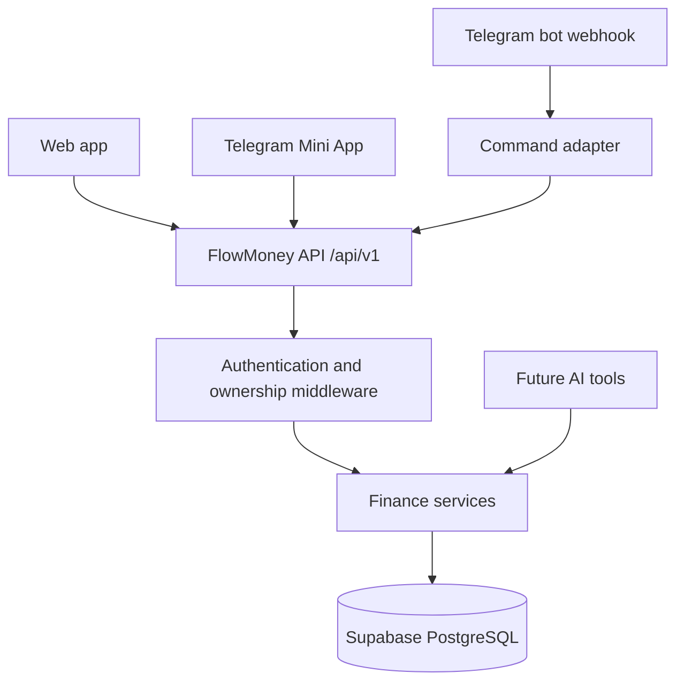

# FlowMoney Architecture

FlowMoney keeps one financial data model and one business-logic boundary for the web app, Telegram bot, Telegram Mini App, and future mobile or AI clients.

## Current Migration Boundary

The current browser UI remains a static vanilla JavaScript application. `localStorage` is retained behind `createLocalFinanceRepository()` so existing data can be validated and migrated after authentication. `createApiFinanceRepository()` implements the same client-side boundary for the future `/api/v1` backend.

The UI should not call Supabase tables directly. The server/API owns validation, user resolution, calculations, audit events, and ownership checks.

## Data Flow

1. A client authenticates through a provider adapter and receives a FlowMoney user context.
2. Protected API routes resolve the authenticated user before loading any resource.
3. Services validate positive integer amounts, wallet/category ownership, date and currency rules.
4. Repositories persist user-scoped rows in Supabase.
5. Dashboard and analytics values are derived from transactions and transfers; they are not stored snapshots.

## Financial Rules

- Amounts are positive integer smallest units. Transaction type determines direction.
- Transfers are separate from income and expense, so they never affect cashflow or total money.
- Wallet balance is initial balance plus income minus expense plus incoming transfers minus outgoing transfers.
- Important financial records use soft deletion and audit events.

## Authentication Flows

### Web

Web authentication creates or resolves a provider-neutral `users` record and a `user_identities` row. API middleware supplies the user ID to every service; routes must never trust a user ID from a request body.

### Telegram Bot

Telegram sends updates to a secret-protected webhook. The adapter parses a command, resolves `telegram_user_id` to `telegram_accounts.user_id`, and calls the same dashboard and finance services as the web API.

### Telegram Mini App

The client sends `Telegram.WebApp.initData` to the server. The server validates the HMAC using the bot token and rejects stale or invalid data. `initDataUnsafe` and manually supplied Telegram IDs are never authentication sources.

## Local Data Migration

1. Read the existing local snapshot.
2. Validate every wallet, transaction, transfer, budget, and goal.
3. Authenticate the user and upload through API endpoints.
4. Compare imported counts and calculated balances with the local snapshot.
5. Only then mark migration complete or remove local data.

## Future AI Boundary

AI must call explicit tools such as `get_balance`, `get_monthly_summary`, `get_category_spending`, and `create_transaction`. It must never receive database credentials or execute arbitrary SQL.